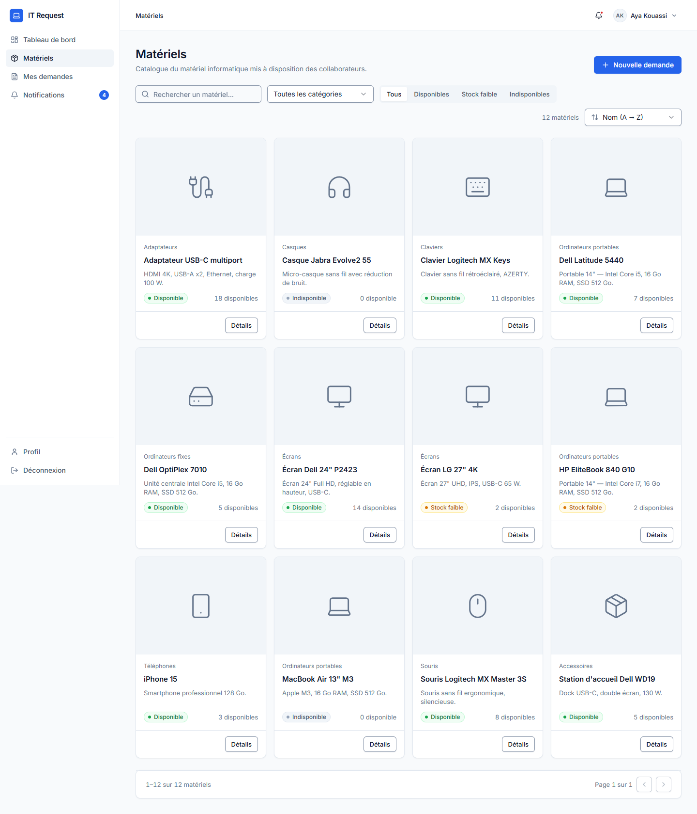

# IT Request Manager

**Gestion simple et centralisée des demandes de matériel informatique.**



---

## Sommaire

1. [Le projet en 30 secondes](#1-le-projet-en-30-secondes)
2. [Lancer le projet](#2-lancer-le-projet)
3. [Comptes de démo](#3-comptes-de-démo)
4. [Démo en 5 minutes](#4-démo-en-5-minutes)
5. [Comment c'est construit](#5-comment-cest-construit)
6. [Organisation du code](#6-organisation-du-code)
7. [Les choix techniques importants](#7-les-choix-techniques-importants)
8. [L'API](#8-lapi)
9. [Tests](#9-tests)
10. [Limites connues et évolutions](#10-limites-connues-et-évolutions)

---

## 1. Le projet en 30 secondes

**Le problème :** dans l'organisation, les demandes de matériel informatique se font à la main. On ne sait pas ce qui est disponible, les demandes se perdent et personne ne suit les stocks.

**La solution :** une application web avec deux types d'utilisateurs.

| Le **collaborateur** peut… | L'**administrateur** peut… |
|---|---|
| consulter le catalogue du matériel disponible | voir toutes les demandes |
| faire une demande de plusieurs matériels, avec un motif | **approuver** une demande (le stock baisse automatiquement) |
| suivre ses demandes et leur historique | **refuser** une demande (motif obligatoire) |
| annuler une demande tant qu'elle est en attente | marquer le matériel comme **remis** |
| recevoir une notification à chaque décision | gérer le matériel, les catégories et les stocks |
| | consulter les statistiques et le journal d'audit |

**Le cycle de vie d'une demande :**

```
                ┌──► Approuvée ──► Remise
En attente ─────┼──► Refusée
                └──► Annulée (par le collaborateur)
```

Aucun autre chemin n'est possible : une demande refusée ne peut pas devenir approuvée, une demande remise ne peut pas revenir en attente.

---

## 2. Lancer le projet

**Prérequis :** Node.js 20 ou plus, et un projet [Supabase](https://supabase.com) (gratuit).

### Étape 1 — Installer les dépendances

```bash
npm install
```

Une seule commande installe l'API **et** le site web (le projet utilise les *npm workspaces*).

### Étape 2 — Préparer la base de données (une seule fois)

```bash
supabase link --project-ref <identifiant-du-projet>
supabase db push
```

Ces commandes créent toutes les tables à partir des fichiers de `supabase/migrations/`.
Exécutez ensuite `supabase/seed.sql` dans le **SQL Editor** de Supabase : il ajoute les catégories et le matériel.

> **Important — désactiver les inscriptions libres.** Dans Supabase, allez dans *Authentication → Sign In / Providers* et désactivez « Allow new users to sign up ». Dans une organisation, c'est l'organisation qui attribue les accès : personne ne doit pouvoir se créer un compte seul.

### Étape 3 — Configurer les variables d'environnement

```bash
cp apps/api/.env.example apps/api/.env
cp apps/web/.env.example apps/web/.env
```

Puis remplissez les deux fichiers avec les valeurs de *Supabase → Settings → API* :

| Variable | Fichier | À quoi elle sert |
|---|---|---|
| `SUPABASE_URL` | `apps/api/.env` | Adresse du projet Supabase |
| `SUPABASE_SERVICE_ROLE_KEY` | `apps/api/.env` **uniquement** | Clé « super-administrateur » de la base. **Elle ne doit jamais aller dans le front ni sur GitHub.** |
| `PORT` | `apps/api/.env` | Port de l'API (3000) |
| `WEB_URL` | `apps/api/.env` | Adresse du site autorisée à appeler l'API (`http://localhost:5173`) |
| `VITE_API_URL` | `apps/web/.env` | Adresse de l'API (`http://localhost:3000/api/v1`) |
| `VITE_SUPABASE_URL` | `apps/web/.env` | Adresse du projet Supabase |
| `VITE_SUPABASE_ANON_KEY` | `apps/web/.env` | Clé publique, utilisée **seulement** pour se connecter |

### Étape 4 — Créer les comptes et les demandes de démo

```bash
npm run seed:demo
```

On peut relancer cette commande sans risque : elle ne crée rien en double.

### Étape 5 — Démarrer

```bash
npm run dev
```

| Service | Adresse |
|---|---|
| Site web | http://localhost:5173 |
| API | http://localhost:3000/api/v1 |
| Documentation de l'API (Swagger) | http://localhost:3000/api/docs |

**Autres commandes utiles :** `npm test` (tous les tests), `npm run lint` (qualité du code), `npm run build` (version de production du site).

---

## 3. Comptes de démo

| Rôle | E-mail | Mot de passe |
|---|---|---|
| Administrateur | `admin@itrm.demo` | `Admin123!` |
| Collaboratrice | `aya@itrm.demo` | `User123!` |
| Collaborateur | `yao@itrm.demo` | `User123!` |

Des demandes existent déjà dans tous les statuts (en attente, approuvée, remise, refusée), pour que chaque écran ait du contenu dès le départ.

---

## 4. Démo en 5 minutes

1. **Connexion collaborateur** (`aya@itrm.demo`) : montrer le tableau de bord et ses demandes récentes.
2. **Catalogue** : rechercher, filtrer par catégorie et par disponibilité. Montrer les badges « Disponible », « Stock faible » et « Indisponible ».
3. **Nouvelle demande** : ajouter deux matériels et un motif, puis l'envoyer. Une référence du type `REQ-2026-000005` est créée.
4. **Connexion admin** (`admin@itrm.demo`) : ouvrir la demande. Le stock actuel est affiché à côté de chaque matériel.
5. **Approuver** : le stock baisse. Tenter d'approuver à nouveau : l'application refuse (409).
6. **Refuser une autre demande** sans motif : c'est bloqué, le motif est obligatoire.
7. **Retour côté collaborateur** : la notification est arrivée, et la chronologie de la demande montre chaque étape.
8. **Bonus** : réduire la fenêtre pour montrer la version mobile, puis ouvrir Swagger.

---

## 5. Comment c'est construit

L'application suit une **architecture 3 tiers** : trois couches, chacune avec un rôle précis.

```
┌──────────────────────────────────────────────┐
│  1. PRÉSENTATION — apps/web                  │   Ce que l'utilisateur voit
│  React : écrans, formulaires                 │
└──────────────────────┬───────────────────────┘
                       │  Requêtes HTTP + jeton de connexion
┌──────────────────────▼───────────────────────┐
│  2. MÉTIER — apps/api                        │   Ce qui décide
│  Express : vérifie qui vous êtes,            │
│  ce que vous avez le droit de faire,         │
│  et si les données sont valides              │
└──────────────────────┬───────────────────────┘
                       │  Requêtes SQL + fonctions
┌──────────────────────▼───────────────────────┐
│  3. DONNÉES — supabase/                      │   Ce qui stocke
│  PostgreSQL : tables, contraintes,           │
│  opérations critiques sécurisées             │
└──────────────────────────────────────────────┘
```

**La règle d'or :** le navigateur ne touche **jamais** directement aux données. Tout passe par l'API, qui contrôle chaque demande. Même un utilisateur qui modifierait le code du site dans son navigateur ne pourrait pas contourner les règles.

C'est un **monolithe modulaire** : une seule API, mais découpée en modules indépendants (matériels, demandes, notifications…). C'est plus simple à développer et à déployer que des microservices, qui ne se justifient pas à cette échelle.

### Les technologies et pourquoi

| Rôle | Technologie | Pourquoi ce choix |
|---|---|---|
| Langage | **JavaScript** | Un seul langage partout. La forme des données est documentée avec des commentaires JSDoc. |
| API | **Express 5** | Simple à lire et à expliquer. Chaque couche (route, contrôleur, service) est visible. |
| Validation | **zod** | Les mêmes règles de validation côté API et côté site, avec des messages en français. |
| Base de données | **Supabase** (PostgreSQL) | Base solide, authentification et stockage d'images déjà inclus. |
| Site web | **React + Vite** | Standard du marché, démarrage rapide. |
| Interface | **Tailwind CSS + shadcn/ui** | Composants modernes et accessibles, fidèles à la maquette. |
| Chargement des données | **TanStack Query** | Gère le cache, le chargement, les erreurs et le rafraîchissement automatique. |
| Formulaires | **React Hook Form + zod** | Validation claire, accessible aux lecteurs d'écran. |
| Tests | **Vitest**, Supertest, Testing Library | Un seul outil de test pour l'API et le site. |

---

## 6. Organisation du code

```
it-request-manager/
├── apps/
│   ├── api/                  ← Tier MÉTIER
│   │   ├── src/
│   │   │   ├── config/        variables d'environnement, connexion Supabase
│   │   │   ├── middlewares/   authentification, rôles, validation, erreurs
│   │   │   ├── modules/       un dossier par sujet : materiels, demandes, notifications…
│   │   │   └── utils/         outils partagés (pagination, conversion, audit)
│   │   ├── docs/openapi.yaml  documentation Swagger
│   │   └── tests/
│   │
│   └── web/                  ← Tier PRÉSENTATION
│       └── src/
│           ├── app/           routes, mise en page
│           ├── components/    composants réutilisables (badges, tableaux…)
│           ├── fonctionnalites/  un dossier par écran : catalogue, demandes, admin…
│           └── lib/           appel à l'API, formatage des dates
│
├── supabase/                 ← Tier DONNÉES
│   ├── migrations/           création des tables, fonctions et sécurité
│   └── seed.sql              catégories et matériel de départ
│
└── docs/                     captures d'écran, guide d'explication
```

**Le trajet d'une requête dans l'API :**

```
Route  →  Middlewares        →  Contrôleur          →  Service               →  Base de données
          (connecté ? admin ?    (lit la requête,       (applique les règles     (enregistre
           données valides ?)    renvoie la réponse)    métier)                   les données)
```

Chaque module de `apps/api/src/modules/` suit ce même découpage : `*.routes.js`, `*.controleur.js`, `*.service.js`, `*.schemas.js`.

---

## 7. Les choix techniques importants

### Le stock ne peut jamais devenir négatif

**Le problème :** il reste 2 écrans. Deux demandes de 2 écrans sont en attente, et deux administrateurs cliquent sur « Approuver » en même temps. Sans précaution, les deux passeraient et le stock tomberait à −2.

**La solution :** l'approbation se fait dans une **fonction PostgreSQL** (`approve_request`) qui fonctionne en **tout ou rien** (une *transaction*) :

1. elle **verrouille** la demande et les lignes de stock concernées : le deuxième administrateur doit attendre que le premier ait fini ;
2. elle vérifie que le stock est suffisant ;
3. elle diminue le stock ;
4. elle change le statut de la demande ;
5. elle enregistre l'historique, la notification et le journal d'audit.

Si une seule étape échoue, **rien** n'est enregistré. Le second administrateur voit le stock déjà diminué et reçoit une erreur claire (409). En dernier filet de sécurité, la base elle-même interdit un stock négatif.

> Pourquoi une fonction SQL ? Parce que la bibliothèque Supabase côté JavaScript ne sait pas regrouper plusieurs requêtes en une seule transaction. La base de données, elle, sait le faire.

### Les transitions de statut sont vérifiées deux fois

- **Dans l'API** (`machineEtat.js`) : une transition impossible est refusée tout de suite, avec un message clair. C'est rapide et facile à tester.
- **Dans la base**, pendant le verrouillage : c'est la garantie finale, même en cas d'accès simultanés.

### La clé secrète reste sur le serveur

Supabase fournit deux clés :
- **la clé publique (anon)**, dans le site, qui sert **uniquement** à se connecter ;
- **la clé de service**, qui a tous les droits, et qui n'existe **que** dans `apps/api/.env`.

### La base est fermée par défaut

La **RLS** (*Row Level Security*, sécurité ligne par ligne) est activée sur toutes les tables, **sans aucune autorisation**. Résultat : même si quelqu'un récupère la clé publique et interroge directement Supabase, il ne voit rien. Seule l'API, avec sa clé de service, accède aux données.

### Le rôle est lu dans la base, jamais dans le navigateur

Le rôle (collaborateur ou admin) est lu dans la table `profiles`, que l'utilisateur ne peut pas modifier. Le menu « Administration » est masqué aux collaborateurs, mais c'est seulement du confort visuel : **la vraie protection est dans l'API**, qui répond 403 (« accès interdit ») à un collaborateur sur une route admin.

### Les références ne peuvent pas être en double

Les références `REQ-2026-000001` viennent d'une **séquence** PostgreSQL, un compteur qui ne donne jamais deux fois le même numéro, même si cent demandes arrivent en même temps. La méthode naïve (« compter les demandes et ajouter 1 ») produirait des doublons.

### Une demande d'un autre collaborateur est « introuvable »

Si un collaborateur tente d'ouvrir la demande d'un collègue, l'API répond **404 (introuvable)** et non 403 (interdit). Ainsi, on ne révèle même pas que la demande existe.

### Le JSON de l'API est en français

Les colonnes de la base restent en anglais (`available_quantity`). L'API les convertit en français (`quantiteDisponible`) dans `utils/convertisseurs.js`, pour que le code du site soit plus lisible.

---

## 8. L'API

Documentation complète et interactive : **http://localhost:3000/api/docs**

Toutes les routes commencent par `/api/v1` et demandent d'être connecté, sauf `/health`.

| Méthode | Route | Qui | À quoi ça sert |
|---|---|---|---|
| GET | `/health` | tout le monde | vérifier que l'API fonctionne |
| GET | `/auth/me` | connecté | récupérer son profil et son rôle |
| GET | `/materials`, `/materials/:id` | connecté | catalogue (matériel actif uniquement) |
| GET | `/categories` | connecté | catégories pour les filtres |
| POST | `/requests` | connecté | créer une demande |
| GET | `/requests/me`, `/requests/:id` | connecté | voir ses demandes |
| PATCH | `/requests/:id/cancel` | connecté | annuler sa demande en attente |
| GET / PATCH | `/notifications…` | connecté | lire ses notifications |
| GET | `/admin/requests`, `/admin/requests/:id` | admin | toutes les demandes |
| PATCH | `/admin/requests/:id/approve` | admin | approuver |
| PATCH | `/admin/requests/:id/reject` | admin | refuser (motif obligatoire) |
| PATCH | `/admin/requests/:id/fulfill` | admin | marquer comme remis |
| GET / POST / PUT / PATCH | `/admin/materials…`, `/admin/categories…` | admin | gérer le catalogue |
| GET | `/admin/dashboard`, `/admin/audit` | admin | statistiques, journal |

**Format des réponses :**

```jsonc
// Une liste
{ "data": [ ... ], "meta": { "page": 1, "limite": 20, "total": 42, "totalPages": 3 } }

// Une erreur
{ "statusCode": 409, "code": "INSUFFICIENT_STOCK", "message": "Stock insuffisant pour ..." }
```

---

## 9. Tests

```bash
npm test
```

**API — 68 tests :**
- les 25 transitions de statut possibles et impossibles ;
- la traduction des erreurs de la base en messages clairs et en codes HTTP ;
- la validation des données (demande vide, quantité à zéro…) ;
- la sécurité : sans connexion → 401, collaborateur sur une route admin → 403 ;
- l'approbation avec un stock insuffisant → 409.

**Site web — 18 tests :**
- affichage des statuts en français ;
- règles du formulaire de nouvelle demande ;
- validation du formulaire de connexion.

Le parcours complet (collaborateur puis admin, sur ordinateur et sur mobile) a aussi été vérifié à la main dans Chrome, sans aucune erreur dans la console.

---

## 10. Limites connues et évolutions

### Limites

- **Écart entre la base déployée et les fichiers de migration.** Sur le projet Supabase utilisé, certaines fonctions ont un nom ou un format de réponse légèrement différent de ceux décrits dans `supabase/migrations/`. L'API gère les deux cas (c'est expliqué en commentaire dans le code), mais il faudrait réaligner les fichiers de migration sur la base réelle.
- **L'audit des modifications de matériel n'est pas atomique.** Modifier un matériel et écrire la ligne d'audit se font en deux requêtes séparées. Une fonction SQL dédiée garantirait le « tout ou rien ».
- **Pas de gestion des utilisateurs dans l'interface** : pas de création de compte par l'admin, pas de désactivation, pas de réinitialisation du mot de passe.
- Le formulaire de nouvelle demande propose au maximum 50 matériels.

### Évolutions possibles

- **Gestion des comptes par l'administrateur** : création avec mot de passe temporaire, changement obligatoire à la première connexion, désactivation d'un compte au départ d'un collaborateur.
- **Connexion via le compte de l'entreprise** (Microsoft 365 ou Google Workspace), pour ne plus gérer de mots de passe dans l'application.
- Notifications en temps réel (Supabase Realtime).
- Export des demandes en CSV.
- Tests de bout en bout automatisés (Playwright).
- Intégration continue avec GitHub Actions.